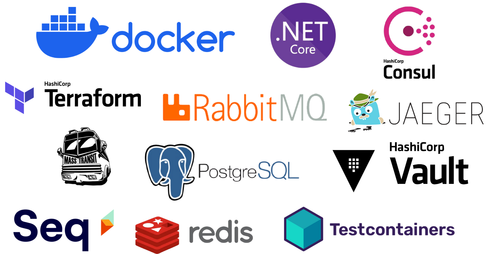

# Rapido

Rapido is the virtual funds transfer app built using **Microservices** architecture, written in [.NET 8.0](https://dotnet.microsoft.com/en-us/download/dotnet/8.0).

Each service is an independent web application with its custom architecture, and the overall integration between the services is mostly based on the **message-driven** approach with **local contracts**.

Depending on the service complexity, different architectural styles are being used, including simple **CRUD** approach, along with **CQRS**, **Clean Architecture** and **Domain-Driven Design**.

The database is being used is [PostgreSQL](https://www.postgresql.org/) & [EntityFrameworkCore](https://learn.microsoft.com/en-us/ef/core/) as ORM, moreover application uses [Redis](https://redis.io/) as a cache and [Vault](https://www.vaultproject.io/) for storing application secrets.

**Disclaimer**: This is **NOT** a commercial project.


# Technologies

Technologies used in the project:

* **[.NET 8](https://dotnet.microsoft.com/en-us/download/dotnet/8.0)**
* **[ASP.NET Core](https://dotnet.microsoft.com/en-us/apps/aspnet)**
* **[EntityFramework Core](https://learn.microsoft.com/en-us/ef/core)**
* **[Docker](https://www.docker.com/)**
* **[PostgreSQL](https://www.postgresql.org/)**
* **[Redis](https://redis.io/)**
* **[RabbitMQ](https://www.rabbitmq.com/)**
* **[Consul](https://www.consul.io/)**
* **[Jaeger](https://www.jaegertracing.io/)**
* **[Vault](https://www.vaultproject.io/)**
* **[Terraform](https://www.terraform.io/)**
* **[Seq](https://datalust.co/seq)**
* **[MassTransit](https://masstransit.io/)**
* **[YARP](https://microsoft.github.io/reverse-proxy/index.html)**
* **[Testcontainers](https://testcontainers.com/)**

And more...



# Solution structure

## Why single repo?
At the beginning, the project wasn't intended to be anything serious. I just wanted to learn the basics of microservices, not build a whole application. In the future, I will consider properly separating the microservices into their own repositories.

## API Gateway
An **API Gateway** acts as a single entry point for clients to access microservices in a system. It routes requests to the appropriate **microservices** using **[YARP](https://github.com/microsoft/reverse-proxy)** as revese proxy.

## Services
Autonomous applications with the different set of responsibilities, decoupled from each other - there's reference between the services and shared packages, and the synchronous communication & asynchronous integration (via messages) is based on local contracts approach.


**Currencies** - fetching & transforming currency exchange rates from third-party **[API](https://www.exchangerate-api.com/)**

**Customers** - managing the customers (create, verify, lock).

**Users** - managing the users/identity (register, login, permissions etc.).

**Wallets** - managing the wallets and owners, responsible for fund transfers(transfer, add, deduct (funds))

**Payments** - managing the deposits and withdrawals from account.

**Notifications** - sending notifications via email (transfer confirmation, account verification, password recovery etc).

## Saga
Simple Saga pattern implementation for transactional handling the business processes spanning across the distinct services.

## Framework
The set of shared components for the common abstractions & cross-cutting concerns. 
In order to achieve even better decoupling and decentralization, it's split into the separate projects.

# Web UI
There is [web UI](https://github.com/str4n/Rapido.Web) written in **[Blazor](https://dotnet.microsoft.com/en-us/apps/aspnet/web-apps/blazor)**. Both projects are still actively developed.

# Starting solution

## 1. Prerequisites:

+ [.NET Core SDK](https://dotnet.microsoft.com/en-us/download/dotnet/8.0)
+ [Git](https://git-scm.com/)
+ [Docker](https://www.docker.com/)
+ [Free API key](https://www.exchangerate-api.com/)

## 2. Clone the repository
Clone repo using git.
```
git clone https://github.com/str4n/Rapido.git
```

## 3. Modify API key
Open ``compose/terraform/seed.tf`` file and replace external api key.
```
apiKeys = {
      external = [
        {
          serviceName = "exchangeRate"
          key         = "secret" <-- Replace this key!
        }
      ]
...
```

## 4. Start infrastructure
To start your infrastructure, use Docker to run the docker-compose file.
```
docker-compose -f compose\infrastructure.yml up -d
```
It will prepare the required infrastructure. Then, you can start the services independently of each other via ``dotnet run`` or use ``docker-compose`` to start whole application.

## 5. Start services
To run whole application use docker-compose again.
```
docker-compose -f compose\services.yml up -d
```


